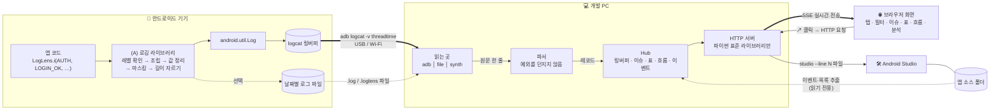
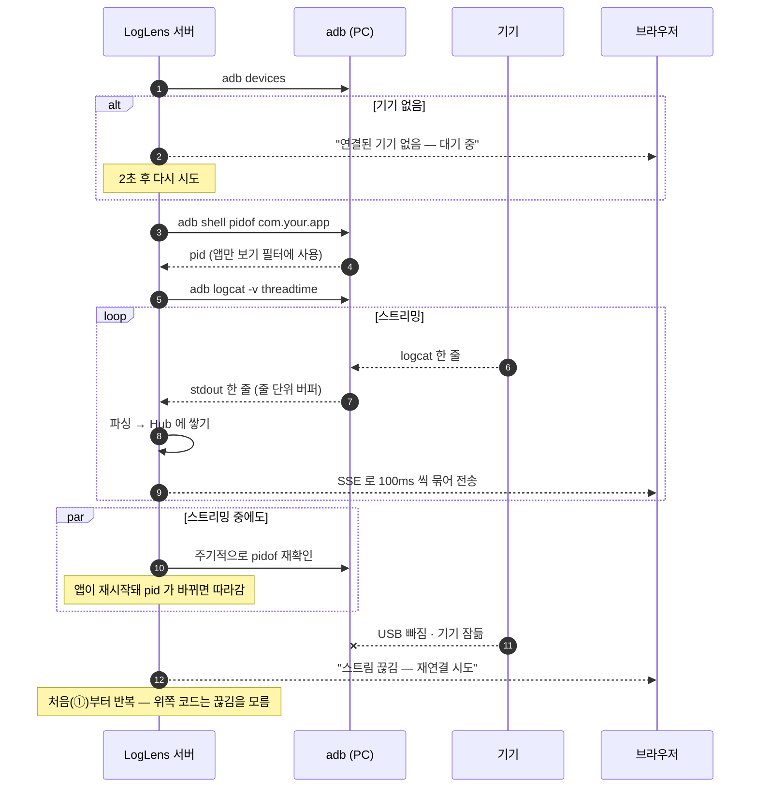
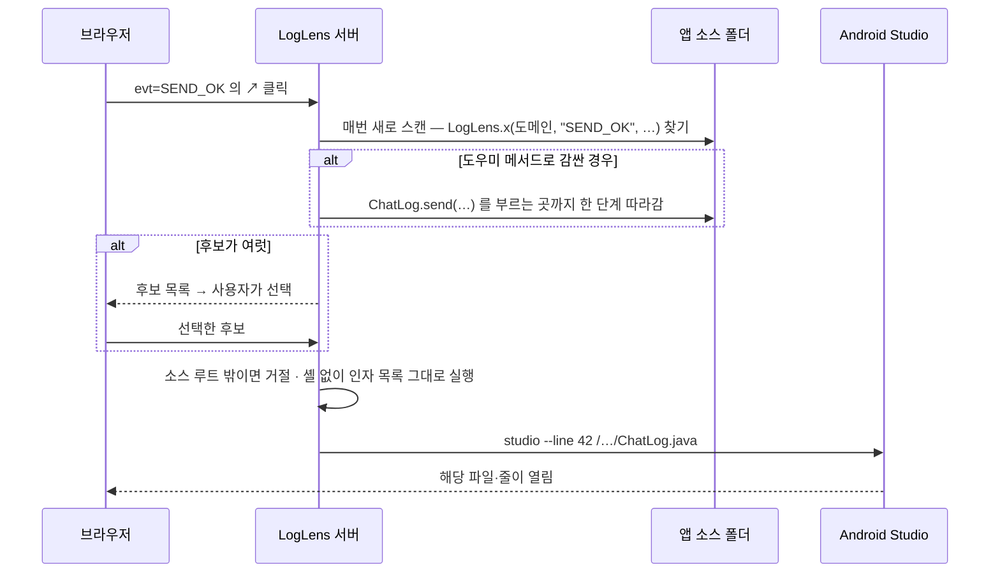
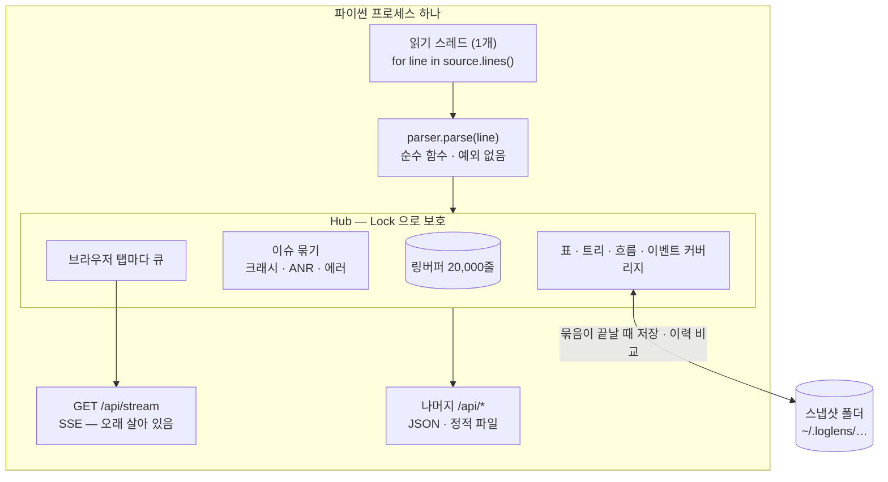

# LogLens

**안드로이드 앱 로그를 정해진 형식으로 찍게 만드는 라이브러리 + 그 형식을 읽어서 분석하고, 로그에서 코드로 바로 건너가게 해 주는 뷰어.**

로그가 지저분하면 아무리 좋은 뷰어를 써도 지저분하게 보입니다. 그래서 이 프로젝트는
뷰어보다 **"로그를 정해진 형식으로 찍게 만드는 쪽"**에 더 무게를 뒀습니다.
뷰어는 그 형식을 믿고 필터링·집계·흐름 추적을 하고, 로그 한 줄에서 그 로그를 찍은
코드 줄까지 Android Studio 로 바로 엽니다.

두 컴포넌트는 서로의 코드를 전혀 참조하지 않습니다. 공유하는 건 **로그 한 줄 형식**뿐입니다.

📄 **문서** — [동작 원리·아키텍처](docs/ARCHITECTURE.md) · [로그 형식 정의](docs/RECORD_FORMAT.md) ·
[구현 결정 기록](docs/DECISIONS.md) · [설계 초안(기획서)](기획서.md) · [문서 안내](docs/README.md)

---

## 목차

1. [30초 만에 보기](#30초-만에-보기)
2. [동작 원리](#동작-원리) — 전체 구조 · adb 연결 · Android Studio 연결 · 뷰어 내부
3. [로그 한 줄의 형식](#로그-한-줄의-형식)
4. [(A) 로깅 라이브러리](#a-로깅-라이브러리)
5. [(B) 뷰어 / 분석기](#b-뷰어--분석기)
6. [이 도구가 요구하는 것](#이-도구가-요구하는-것--솔직하게)
7. [검증](#검증)

---

## 30초 만에 보기

기기도, adb도, 파이썬 패키지 설치도 필요 없습니다.

```bash
make viewer     # 가짜 로그를 만들어서 뷰어 실행 → http://127.0.0.1:8420
```

```bash
make demo       # 진짜 라이브러리 → 파일 → 뷰어  (전 구간 연결)
make emit       # 로그가 어떤 모양으로 찍히는지 터미널에서 확인
make test       # 전체 검증 (뷰어 + 라이브러리 + 양쪽 대조)
make aar        # 배포용 .aar 생성
```

실제 기기에 붙일 때:

```bash
loglens --source adb --package com.your.app --config your-app.json
```

---

## 동작 원리

### 1. 전체 구조



경계는 세 곳이고, 각 경계에서 보장하는 게 다릅니다.

| 경계 | 넘어가는 것 | 보장하는 것 |
|---|---|---|
| 앱 → logcat | 값 정리·마스킹·길이 자르기가 끝난 한 줄 | 줄바꿈 없음, 4KB 이내, 민감 정보 가려짐 |
| 기기 → PC | `adb logcat -v threadtime` 이 출력하는 텍스트 | 형식 고정, 끊기면 자동 재연결 |
| 서버 → 브라우저 | 파싱된 레코드를 JSON 으로 묶은 것 | 100ms 씩 묶어서 전송, 못 따라오는 쪽은 오래된 것부터 버림 |

### 2. 뷰어가 adb 로 기기에 붙는 방법

브라우저는 보안 정책 때문에 USB 나 adb 에 직접 접근할 수 없습니다. 그래서 PC 에서 도는
작은 파이썬 서버가 **adb 를 대신 실행**하고, 읽은 줄을 파싱해서 브라우저로 밀어줍니다.
Android Studio 의 Logcat 창이 쓰는 것과 같은 adb 서버를 함께 쓰기 때문에, 둘을 동시에 켜 둬도 됩니다.



### 3. 로그에서 Android Studio 코드 줄로

뷰어는 앱 소스 폴더를 **읽기만** 합니다. 로그 줄의 `↗`, 크래시 스택의 `at …(Foo.kt:88)`,
설정 목록 항목을 누르면 서버가 그 로그를 찍은 줄을 찾아 설정된 명령으로 IDE 를 엽니다.



```jsonc
// your-app.json — 어떤 IDE 로 열지는 설정의 인자 목록으로 정합니다
"eventSource": {
  "root": "~/StudioProjects/your-app/app/src",
  "open": ["/Applications/Android Studio.app/Contents/MacOS/studio", "--line", "{line}", "{abs}"]
}
```

소스를 누를 때마다 다시 읽기 때문에 코드를 고친 뒤에도 맞는 줄로 갑니다.
크래시 스택은 클래스명이 아니라 **패키지 경로 + 괄호 안 파일명**으로 찾습니다(코틀린 `FooKt`, 내부 클래스 `Foo$Bar`).
줄 번호는 기기에 깔린 빌드 기준입니다.

### 4. 뷰어 내부



파싱은 **스레드 하나에서만** 합니다. 정규식 매칭은 싸고 순서가 더 중요하기 때문입니다.
읽는 곳(`adb` / `file` / `synth`)이 같은 인터페이스 뒤에 있어서, 기기 없이도 뷰어 전체를
개발·테스트·시연할 수 있습니다. 재연결 처리는 adb 쪽에만 있습니다.

더 자세한 내용 → [docs/ARCHITECTURE.md](docs/ARCHITECTURE.md)

---

## 로그 한 줄의 형식

```
<레벨>/<접두사>_<도메인>: evt=<이벤트> 키=값 키=값 | <자유 메시지>
```

```
2026-08-12 11:41:24.931 I/APP_AUTH: evt=LOGIN_OK flowId=f9254 uid=668 | 로그인 성공
2026-08-12 11:41:24.937 E/APP_NET: evt=REQUEST_FAIL host=api.example.test code=500 err=ConnectException:timeout
2026-08-12 11:41:24.930 I/APP_AUTH: evt=TOKEN_ISSUE flowId=f9254 token=*** expiresIn=3600 authType=oauth2
```

마지막 줄을 보면 `token`은 `***`로 가려졌는데 `authType`은 그대로입니다.
민감한 값을 가릴 때 **키 이름이 정확히 일치할 때만** 가리기 때문입니다.
`auth`가 들어간 키를 전부 가리는 식으로 만들면 `authType`처럼 멀쩡한 필드까지
안 보이게 되고, 그러면 개발자가 마스킹을 우회하기 시작합니다.

**반드시 지켜야 하는 규칙 네 가지**

- **태그는 `<접두사>_<도메인>`** — 그래야 `adb logcat -s APP_AUTH:*` 가 곧바로 도메인 필터가 됩니다
- **로그 한 줄이 레코드 하나** — logcat 은 4KB 근처에서 자르므로, 먼저 잘라 두고 `...[cut]`을 붙입니다
- **값에는 공백, `|`, 줄바꿈이 없음** — 라이브러리가 치환합니다
- **파서는 어떤 입력에도 예외를 던지지 않음** — 형식에 안 맞는 줄은 버리지 않고 등급을 낮춰 보여줍니다

정확한 정의 → [docs/RECORD_FORMAT.md](docs/RECORD_FORMAT.md)

---

## (A) 로깅 라이브러리

```kotlin
// 앱 시작할 때 한 줄
LogLensAndroid.install(this)

// 호출부 — Kotlin
LogLens.i(AppDomain.AUTH, "LOGIN_OK", "uid" to uid, "msg" to "로그인 성공")
LogLens.e(AppDomain.NET, "SOCKET_FAIL", e, "host" to host)
```

```java
// 자바에서도 그대로 — 가변 인자 형태
LogLens.i(AppDomainJava.AUTH, "LOGIN_OK", "uid", uid, "msg", "로그인 성공");
LogLens.e(AppDomainJava.NET, "SOCKET_FAIL", e, "host", host);
```

Kotlin 쪽은 `"uid" to uid` 라서 키-값 짝이 컴파일 시점에 보장됩니다. 자바가 대부분인 프로젝트에서
필드마다 `new Pair<>()` 를 쓰게 하면 마찰이 커서, 자바용 가변 인자 API 를 따로 냅니다.

### 요청·응답 본문을 통째로 남길 때

서버에서 받은 JSON·XML 을 그대로 봐야 할 때가 있습니다. 일반 로그에 넣으면 한 줄 한도(약 4KB)에서
잘리고 줄바꿈도 되돌릴 수 없습니다. 그래서 따로 부릅니다.

```kotlin
LogLens.i(AppDomain.MEMBER, "ADDR_ADD_OK", "flowId" to flowId, "count" to n)        // 요약 (늘 하던 대로)
LogLens.payload(AppDomain.MEMBER, "ADDR_ADD_RES_BODY", responseText, "flowId" to flowId)   // 본문 통째로
```

```java
LogLens.payload(AppDomain.MEMBER, "ADDR_ADD_RES_BODY", responseText, "flowId", flowId);
```

- 길면 여러 줄로 **나눠** 보내고 뷰어가 다시 합칩니다. 글자 하나 안 바뀌고 돌아옵니다 (줄바꿈·백슬래시 포함)
- 본문 안의 민감한 키(`token`, `mobile` …)도 값을 `***` 로 가립니다. 최선의 노력이라 **로그인·토큰·인증 응답은 싣지 않습니다**
- **디버그 빌드에서만** 나갑니다. 릴리스에서 여는 방법은 없습니다. 파일 로그에도 기본으로 남지 않습니다
- 본문은 받은 그대로 넘깁니다 (들여쓰기를 넣거나 줄이지 않습니다). 이벤트 이름은 요약 로그와 다르게 짓습니다
- 한 번에 64KB 까지 싣고, 넘으면 뒤를 버린 뒤 그렇다고 표시합니다 (`LogLens.setPayloadMaxBytes`)

### 도메인 목록은 앱이 직접 정합니다

도메인 목록을 라이브러리에 enum 으로 박으면 그 순간 다른 프로젝트에서 못 씁니다.

```kotlin
// 라이브러리 — 도메인이 뭔지 모릅니다
fun interface LogDomain { fun tag(): String }

// 앱 — 자기 도메인을 정의합니다
enum class AppDomain : LogDomain {
    AUTH, CHAT, NET, FILE_XFER;
    override fun tag() = "APP_$name"
}
```

Kotlin·Java 예시가 `lib/sample-domains` 에 있습니다. 맞는 걸 복사해 쓰면 됩니다.

### 구성과 붙이는 법

| 모듈 | 내용 | 필요한 것 |
|---|---|---|
| `lib/core` | 진입점 `LogLens`, 포매터, 값 정리, 마스킹, 길이 자르기, 파일 저장 | Kotlin stdlib 만 |
| `lib/android` | logcat 출력, 앱 초기화 도우미 | Android |
| `lib/sample-domains` | 도메인 정의 예시 (배포 안 함) | core |

```bash
make aar    # → lib/android/build/outputs/aar/loglens-release.aar  (52KB, core 포함)
```

`core` 가 안드로이드를 참조하지 않는 건 의도한 것입니다. 일반 JVM 에서 테스트하고,
뷰어 파서와 서로 대조하는 검증을 돌리기 위해서입니다.

### 호출부가 신경 쓰지 않아도 되는 것들

- **개인정보** — `token`, `password` 같은 키는 알아서 `***`
- **릴리스 빌드** — 기본으로 **아무것도 내보내지 않습니다.** 문자열을 조립하기도 전에 거릅니다. `init()` 전 기본값이 "디버그 아님"이라 초기화를 깜빡해도 새지 않습니다
- **너무 긴 값** — 글자 단위로 잘라 한글·이모지가 깨지지 않습니다
- **출력 중 예외** — 삼킵니다. 로그 때문에 앱이 죽으면 안 되니까요

릴리스에서도 경고·에러를 받아 봐야 하는 앱은 초기화할 때 **직접 골라서** 엽니다. 고르지 않으면 닫혀 있습니다.

```kotlin
LogLensAndroid.install(this)                                              // 릴리스: 아무것도 (기본)
LogLensAndroid.install(this, false, ReleasePolicy.WARN_AND_ABOVE)         // 릴리스: W, E 만
LogLensAndroid.install(this, false, ReleasePolicy.SILENT.withRuntimeSwitch())
//  ↑ 평소엔 조용하다가, 현장에서 `adb shell setprop log.tag.APP_CHAT VERBOSE` 로 도메인 하나만 엽니다
//    (태그가 곧 도메인이라 가능합니다. 태그 23자 제한 주의. adb 를 붙일 수 있으면 누구나 켤 수 있습니다)
```

원문(`payload`)은 무엇을 고르든 릴리스에서 나가지 않습니다.

---

## (B) 뷰어 / 분석기

파이썬 표준 라이브러리만 씁니다 (3.9+). 설치할 패키지가 없습니다.

### 보기

- **도메인 탭** — 라이브러리를 아직 안 쓰는 예전 태그도 정규식으로 같은 탭에 모읍니다
- **레벨 / 검색 / 정규식 필터**, **앱만 보기** (`--package`, 앱 재시작해도 따라감)
- **이슈 목록** — 크래시(예외 클래스별) / ANR / 네이티브 크래시 / 형식 맞는 에러를 자동으로 묶어 셉니다.
  이슈를 보는 중에는 앱만 보기를 끕니다 — ANR 은 시스템이 찍기 때문입니다
- **계층 트리** — 누르면 그 아래를 불러오는 조직도·주소록 로그를 `parent` 로 다시 세웁니다.
  못 본 가지는 `+4 미관측` 으로, `depth` 가 어긋나면 경고로 보여줍니다
- **원문 보기** — 요청·응답 본문(`LogLens.payload`)은 목록에 한 줄로 접혀 있고, 누르면 형식에 맞춰 펼칩니다.
  JSON·XML 은 접고 펴는 **구조**, 들여쓰기만 다시 한 **정리된 원문**, **받은 그대로** 세 가지로 봅니다.
  값은 받은 글자 그대로입니다 (큰 숫자도 바뀌지 않습니다). 조각이 빠졌으면 어디가 없는지 표시합니다.
  `원문만` 필터나 탭 설정(`"payload": "only"`)으로 따로 모아 볼 수 있습니다
- **표로 묶기** — 수백 줄씩 오는 설정 목록을 묶음마다 한 줄로 접고, 누르면 표로 엽니다
  - 두 묶음 비교(추가·삭제·변경), 앱이 구현한 목록과 대조한 **켜짐/꺼짐**, 값 형식 검사
  - 목록은 뷰어가 뜰 때마다 **앱 소스에서 다시 뽑고**, 항목에서 코드 위치로 바로 엽니다
  - **스냅샷**으로 뷰어를 다시 켜도 지난 로그인과 비교하고, 여러 번에 걸친 이력을 봅니다

### 추적

- **로그 → 코드 줄**, **크래시 스택 → 코드** — [위 그림](#3-로그에서-android-studio-코드-줄로)
- **흐름 타임라인** — `flowId` 를 누르면 그 흐름만 세로 타임라인으로. 단계 간격, 멈춘 단계, 그 시간대 경고·에러를 한 화면에
- **기준선** — 정상 흐름을 저장해 두면 같은 종류를 자동으로 견줍니다 (빠진·새·순서 바뀐·느린 단계)

### 분석

- **성공률 · 실패 사유 분포 · 단계별 이탈 · 도메인/이벤트 빈도** — 형식을 지킨 로그라서 가능한 기능입니다
- **이벤트 커버리지** — 소스에서 찍을 수 있는 이벤트 중 한 번도 안 지나간 것 (= 안 탄 코드 경로)
- **이벤트 사전 · 이름 검사** — 이벤트별 선언 필드와 실제 값, 같은 필드를 다르게 적은 것(`userId`/`user_id`),
  사유 없는 실패, 짝 없는 성공을 알려줍니다

### 공유

- **세션 파일** — 지금 로그를 `.loglens` 로 저장하면 팀원이 기기 없이 뷰어에 끌어다 놓아 엽니다.
  원문 본문은 기본으로 **빼고** 저장합니다 (개인정보가 남아 있을 수 있어서). 넣으려면 "원문까지 넣어 저장"
- **Markdown 복사 / CSV 저장** — 보이는 그대로

### 프로젝트마다 설정 파일로 맞춥니다

탭 목록도 이슈 규칙도 코드에 없습니다. [`config.json`](viewer/examples/sample-app.json)
([스키마](viewer/config.schema.json))만 바꿔 끼우면 됩니다.

```bash
loglens --source adb  --package com.your.app --config your-app.json
loglens --source file --file dump.log --follow     # 저장해 둔 로그 재생
loglens --source synth                             # 기기 없이 가짜 로그로 데모
loglens --source adb  --package com.your.app --init your-app.json   # 설정 초안 자동 생성
```

`--init` 은 기기의 최근 logcat 에서 **그 앱이 찍은 태그 이름과 개수만** 읽어 비슷한 것끼리 탭으로 묶습니다.
로그 내용은 쓰지 않습니다 (테스트로 막아 뒀습니다). 처음 붙이는 순서 → [아키텍처 문서 §9](docs/ARCHITECTURE.md)

---

## 이 도구가 요구하는 것 — 솔직하게

**분석 기능은 로그가 형식을 지킬 때만 동작합니다.** 결함이 아니라 전제입니다.

| 기능 | 필요한 것 | 앱을 안 고쳐도? |
|---|---|:--:|
| 필터 · 앱만 보기 · 도메인 탭 | 없음 | ✅ |
| 크래시 · ANR · 네이티브 이슈 묶기 | 없음 — 시스템 로그를 읽습니다 | ✅ |
| 크래시 스택 → 코드 | 앱 소스 폴더 | ✅ |
| 도메인 / 이벤트 빈도, 로그 → 코드 | 형식에 맞는 로그 | ❌ |
| **성공률** | 이벤트 이름을 `_OK` / `_FAIL` 로 통일 | ❌ |
| **실패 사유 분포** | 실패 로그에 `reason=` 또는 `err=` | ❌ |
| **흐름 · 단계별 이탈 · 기준선** | 흐름 전체에 `flowId=` | ❌ |

실질적인 최소 단위는 **호출부 한 곳이 아니라 "흐름 하나 전체"**입니다. 로그인이든 메시지 전송이든
시작·분기·끝이 다 기록된 흐름 하나에서 처음으로 일반 뷰어가 못 하는 화면이 나옵니다.

지저분한 로그를 알아서 정리해 주는 도구가 아니라, **형식을 지키면 그만큼 돌려받게 만드는 도구**입니다.
형식을 안 지킨 로그도 사라지지는 않고 분석에서만 빠집니다.

---

## 검증

직접 쓴 테스트 데이터에는 같은 오해가 양쪽에 들어갈 수 있습니다. 그래서 진짜 검증은
**Kotlin 라이브러리가 만든 줄을 Python 파서로 읽어 필드를 비교**하는 식으로 합니다.
기대값은 라이브러리 출력이 아니라 입력값에서 따로 계산하고, 일부러 망가뜨려서 검사가 잡는지도 확인했습니다.

```bash
make roundtrip
# roundtrip: 71 passed, 0 failed  (EXACT 24, TRUNC 4, PAYLOAD 43)
```

| | |
|---|---|
| 뷰어 | 241개 테스트 통과 (Python 3.9 · 3.10) |
| 라이브러리 core | 97개 테스트 통과 (Kotlin, kotlin.test) |
| 양쪽 대조 | 71개 케이스 통과 (Kotlin · Java 두 API 모두, 원문 43개 포함) |
| `.aar` | 빌드 확인 (AGP 8.7.3 / Kotlin 2.0.21, 52KB) |
| 실제 기기 | 업무 앱에 적용해 확인 — adb 연결·앱 추적·재연결, 설정 자동 생성, 흐름 추적, 로그 → Android Studio 이동 |

자세한 내용과 초안에서 바뀐 이유 → [docs/DECISIONS.md](docs/DECISIONS.md)

---

## 라이선스

MIT
